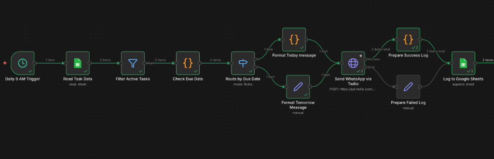
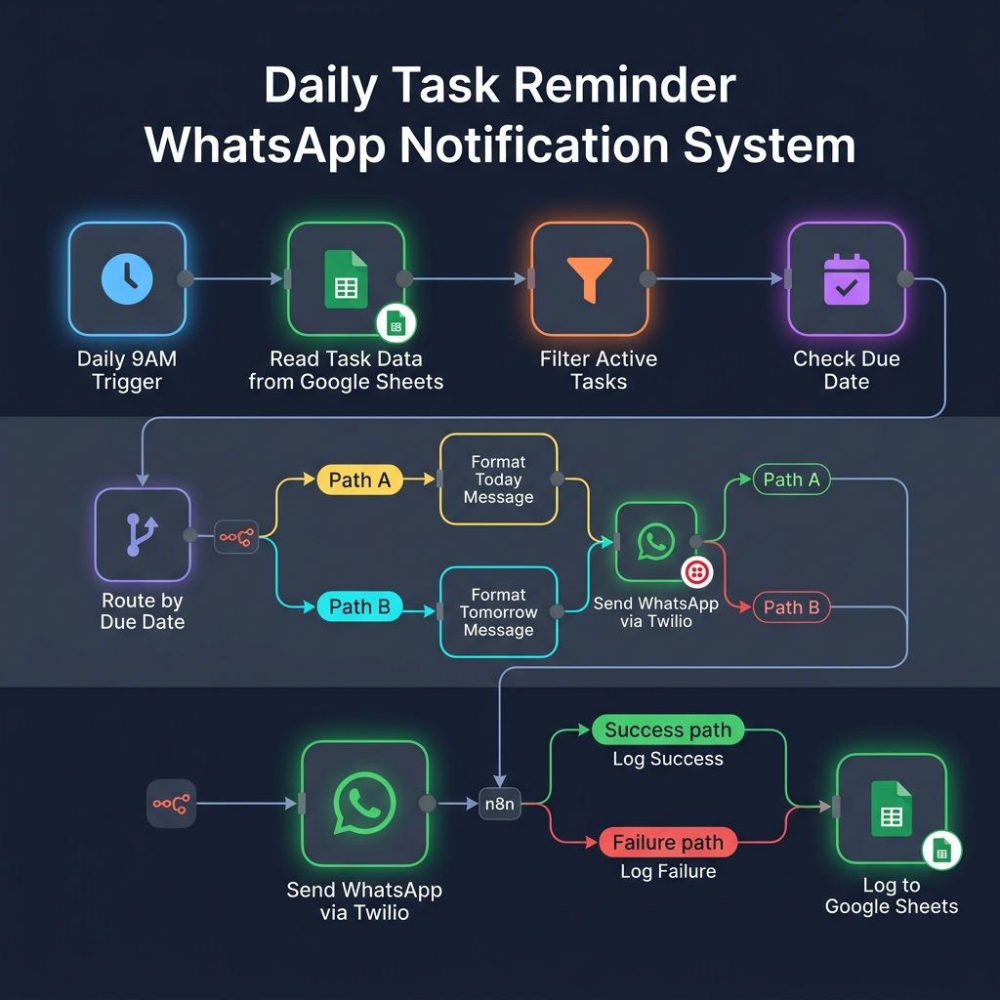

<div align="center">

# 📲 Daily Task Reminder — WhatsApp Notification System

### Automated task reminders via WhatsApp, powered by n8n, Google Sheets & Twilio

[](https://n8n.io)
[](https://sheets.google.com)
[](https://twilio.com)
[](https://whatsapp.com)

*Built for [Cymasonic Labs](https://github.com/ighackerbot)*

</div>

---

## 🧠 Overview

This project is an **n8n automation workflow** that reads task data from a Google Sheet every morning at **9:00 AM**, identifies tasks that are due **today** or **tomorrow**, and sends personalized **WhatsApp reminder notifications** to assigned team members via the **Twilio API**. All message delivery results (success/failure) are logged back to the Google Sheet for audit tracking.

---

## 🏗️ Architecture & Workflow

### n8n Workflow Editor

<div align="center">



*↑ Actual n8n workflow showing all nodes with execution data*

</div>

### Pipeline Overview

<div align="center">



</div>

```
 ⏰ Trigger ──▶ 📊 Read Sheets ──▶ 🔍 Filter Active ──▶ 📅 Check Due Date
                                                               │
                                                        ┌──────┴──────┐
                                                        ▼             ▼
                                                   📝 Today      📝 Tomorrow
                                                   Message       Message
                                                        └──────┬──────┘
                                                               ▼
                                                     📱 Send WhatsApp
                                                        (Twilio)
                                                        ┌──────┴──────┐
                                                        ▼             ▼
                                                   ✅ Success    ❌ Failed
                                                      Log          Log
                                                        └──────┬──────┘
                                                               ▼
                                                     📊 Log to Google
                                                         Sheets
```

---

## 🔧 Tech Stack

| Technology | Role | Description |
|:----------:|:----:|:------------|
| **n8n** | Workflow Engine | Open-source automation platform orchestrating the entire pipeline |
| **Google Sheets** | Data Store | Serves as both the task database (Sheet1) and notification log (Sheet2) |
| **Twilio** | Messaging API | Sends WhatsApp messages via Twilio's WhatsApp Business API sandbox |
| **JavaScript** | Logic Layer | Custom code nodes for date comparison and message formatting |

---

## 📊 Google Sheets Schema

### Sheet1 — Task Data (Input)

| Column | Type | Description |
|--------|------|-------------|
| `Task Name` | String | Name/title of the task |
| `Due Date` | Date | Deadline for task completion |
| `Status` | String | Current status (`Pending`, `In Progress`, `Completed`) |
| `Phone` | String | Assignee's phone number (with country code, e.g., `919876543210`) |

### Sheet2 — Notification Log (Output)

| Column | Type | Description |
|--------|------|-------------|
| `Task Name` | String | Name of the task the notification was sent for |
| `Phone` | String | Recipient's phone number |
| `Timestamp` | ISO 8601 | When the notification was sent |
| `Status` | String | Delivery result: `Sent` or `Failed` |

---

## ⚙️ Node Breakdown

### 1. 🕘 Daily 9 AM Trigger
- **Type:** Schedule Trigger
- **Config:** Fires daily at 9:00 AM server time
- **Purpose:** Initiates the workflow automatically every morning

### 2. 📊 Read Task Data
- **Type:** Google Sheets (Read)
- **Config:** Reads all rows from **Sheet1** of the configured spreadsheet
- **Auth:** Google Sheets OAuth2 API

### 3. 🔍 Filter Active Tasks
- **Type:** Filter
- **Logic:** `Status ≠ "Completed"` (strict, case-sensitive)
- **Purpose:** Removes completed tasks so only pending/in-progress tasks are processed

### 4. 📅 Check Due Date
- **Type:** Code (JavaScript)
- **Logic:**
  ```javascript
  // Compares each task's Due Date against today's date
  // Tags each task with one of: 'today', 'tomorrow', 'overdue', 'future'
  ```
- **Purpose:** Classifies tasks by urgency relative to the current date

### 5. 🔀 Route by Due Date
- **Type:** Switch
- **Branches:**
  - **Output 0:** `dueStatus == "today"` → Format Today Message
  - **Output 1:** `dueStatus == "tomorrow"` → Format Tomorrow Message
  - Tasks marked `overdue` or `future` are not routed (silently dropped)

### 6. 📝 Format Today Message
- **Type:** Code (JavaScript)
- **Output:** `Reminder: Task "<TaskName>" is due <DueDate>. Please ensure completion. - Cymasonic Labs`

### 7. 📝 Format Tomorrow Message
- **Type:** Set
- **Output:** `Reminder: Task '<TaskName>' is due TOMORROW`

### 8. 📱 Send WhatsApp via Twilio
- **Type:** HTTP Request (POST)
- **Endpoint:** `https://api.twilio.com/2010-04-01/Accounts/{AccountSID}/Messages.json`
- **Params:**
  - `To`: `whatsapp:+{Phone}`
  - `From`: `whatsapp:+14155238886` (Twilio Sandbox)
  - `Body`: Formatted reminder message
- **Error Handling:** `continueErrorOutput` — routes to success/failure branches

### 9. ✅ Prepare Success Log / ❌ Prepare Failed Log
- **Type:** Code / Set
- **Purpose:** Formats log entry with Task Name, Phone, ISO Timestamp, and Status (`Sent` / `Failed`)

### 10. 📊 Log to Google Sheets
- **Type:** Google Sheets (Append)
- **Config:** Appends log entry to **Sheet2** of the same spreadsheet
- **Auth:** Google Sheets OAuth2 API

---

## 🚀 Setup & Deployment

### Prerequisites

- [n8n](https://docs.n8n.io/getting-started/installation/) installed (self-hosted or cloud)
- A [Google Cloud](https://console.cloud.google.com/) project with Sheets API enabled + OAuth2 credentials
- A [Twilio](https://www.twilio.com/try-twilio) account with WhatsApp Sandbox activated
- A Google Sheet set up with the schema described above

### Steps

1. **Import the Workflow**
   ```bash
   # In n8n, go to Workflows → Import from File
   # Select: "Daily Task Reminder WhatsApp Notification System (1).json"
   ```

2. **Configure Credentials**
   - **Google Sheets OAuth2 API** — Add your Google OAuth2 client ID & secret
   - **Twilio HTTP Basic Auth** — Add your Twilio Account SID (username) and Auth Token (password)

3. **Update the Google Sheet ID**
   - Open the **Read Task Data** and **Log to Google Sheets** nodes
   - Replace the `documentId` with your own Google Sheet's ID
   - The Sheet ID is the long string in your Google Sheets URL:
     ```
     https://docs.google.com/spreadsheets/d/{THIS_IS_YOUR_SHEET_ID}/edit
     ```

4. **Activate the Workflow**
   - Toggle the workflow to **Active** in the n8n editor
   - The schedule trigger will now fire daily at 9:00 AM

5. **Join Twilio WhatsApp Sandbox** *(for testing)*
   - Send `join <your-sandbox-keyword>` to **+1 415 523 8886** on WhatsApp
   - Each recipient must join the sandbox before receiving messages

---

## 📁 Project Structure

```
task-reminder-automation/
├── Daily Task Reminder WhatsApp Notification System (1).json   # n8n workflow export
├── README.md                                                    # Documentation
├── n8n-workflow-screenshot.png                                  # n8n editor screenshot
└── workflow-diagram.png                                         # Architecture diagram
```

---

## 👤 Author

**Anuj Jain**
(https://github.com/ighackerbot)

Newton School of Technology

---

<div align="center">

*Built with ❤️ using n8n + Twilio + Google Sheets*

</div>
